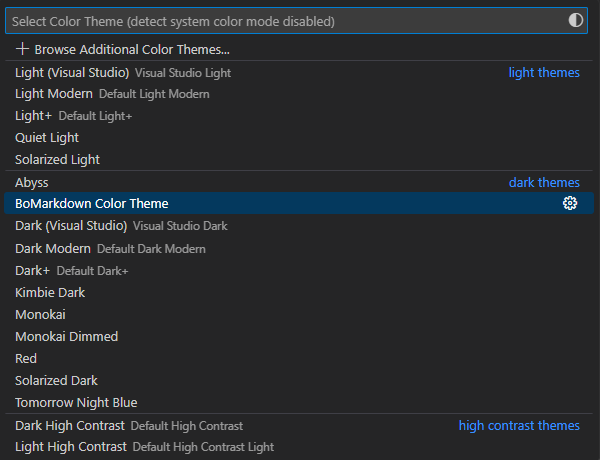
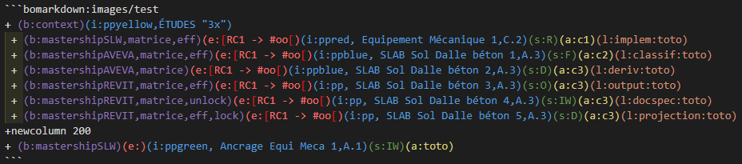
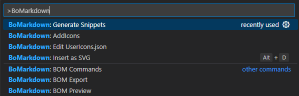

# Color Theme for BoMarkdown syntax README

This extension :
- Works with [BoMarkdown Extension](https://github.com/Roeperni/bomarkdown)
- Aims to facilitate BoMarkdown syntax reading and usage
- Adds a theme called "BoMarkdown Color Theme"
- Is composed of :
  1. A theme file that includes the default Dark Modern theme and adds tokenColors specificaly for BoMarkdown usage (bomarkdown-grammar.json).
  2. A grammar file that defines patterns which apply defined colors in theme file (bomarkdown-grammar.json)

Theme "BoMarkdown Color Theme" added in Themes Menu (Ctrl K + Ctrl T) : 

Example : 

By default :

***

"# bomarkdown-color-theme" 