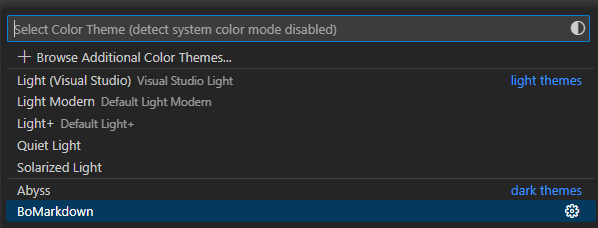
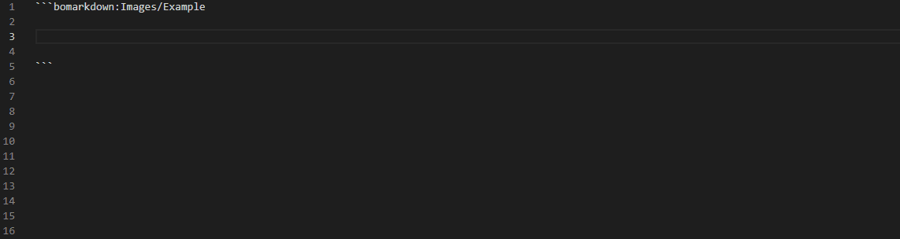

# Color Theme and Snippets for BoMarkdown README

This extension :
- Works with [BoMarkdown Extension](https://github.com/Roeperni/bomarkdown)
- Aims to facilitate BoMarkdown syntax reading and typing
- Adds a theme called "_BoMarkdown_"
- Is composed of :
  1. A theme file that includes the default Dark Modern theme and adds tokenColors specificaly for BoMarkdown usage (_bomarkdown-color-theme.json_).
  2. A grammar file that defines patterns which apply defined colors in theme file (_bomarkdown-grammar.json_)
  3. A _snippets.code-snippets_ file generated by python code through the command "*BoMarkdown: Generate Snippets*" that creates snippets based on user's _settings.json_ and BoMarkdown extension _UserIcons.json_.

Theme "BoMarkdown" added in Themes Menu: 

BoMarkdown Theme illustration: 

By default without BoMarkdown Theme:

Command "_BoMarkdown: Generate Snippets_" illustration:

Illustrated auto-completion based on snippets :

